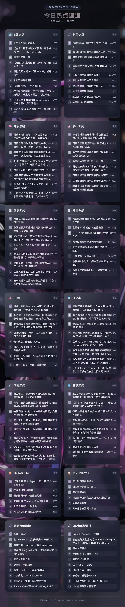
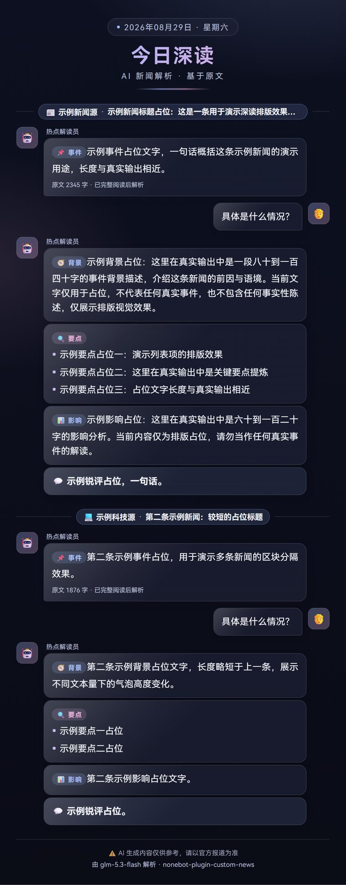
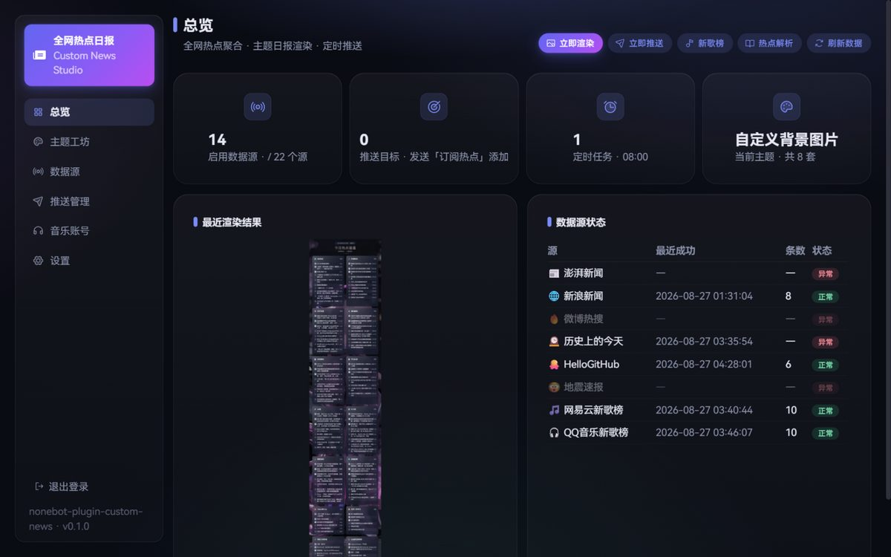
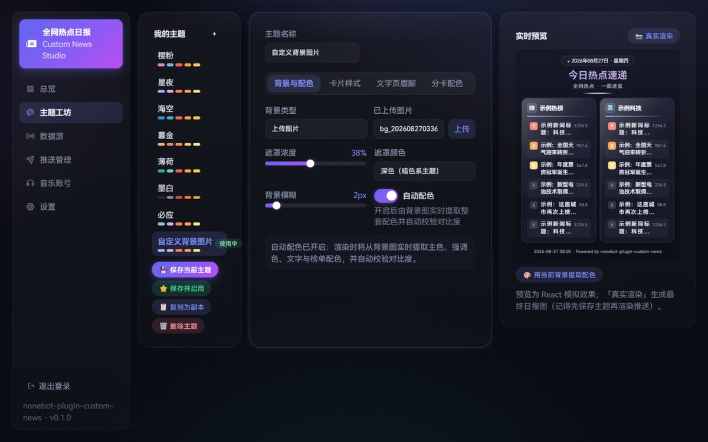

<div align="center">

# nonebot-plugin-custom-news

**全网热点日报 · 一图速览**

B站 / 微博 / 澎湃 / 头条 / IT之家 / 36氪 / 网易云·QQ新歌榜 …… 22 个数据源，
渲染成高自定义主题卡片日报图，定时推送到群与私聊。
深空玻璃质感 WebUI，可视化定制一切。


</div>

---

## 效果速览

<p align="center">
  
  
</p>

<p align="center"><sub>左：主题化日报卡片（背景图自动取色 + 毛玻璃 + 榜单斑马纹） · 右：「今日深读」AI 深度解读（聊天记录风格，基于新闻原文）</sub></p>

## ✨ 功能亮点

- **全网热点聚合** — 基于 [DailyHotApi](https://github.com/imsyy/DailyHotApi) 的 20 个源（B站/微博/澎湃/头条/IT之家/36氪/虎嗅/豆瓣/贴吧/知乎热榜等），滑块开关 + 自定义任意路由；另有直连公开接口的特色源：**网易云 / QQ音乐新歌榜**、**AI 智商天梯**（[codexradar](https://deng.codexradar.com) 实时评测）、**大模型上新监控**（主流厂商新模型发布自动播报）
- **主题化日报图** — 背景图（预设 6 张 / 上传 / 必应每日壁纸）+ ColorThief 自动取色（主色调遮罩，背景-卡片-标题浑然一体，WCAG 对比度校验）+ 毛玻璃卡片，一切可视化定制
- **AI 新闻深读** — 日报后自动跟随或命令触发：抓取新闻**原文**（trafilatura 提取正文）交给 LLM，输出聊天记录风格的深度解读图（事件 / 背景 / 要点 / 影响 / 锐评）；生成上限（max_tokens）可配置，适配推理模型
- **大模型上新监控** — 聚合 models.dev 的主流厂商官方模型目录（OpenAI / Anthropic / Google / DeepSeek / 智谱 / 月之暗面 / MiniMax / xAI / Mistral / Meta / 阿里），与本地基线对比，有新模型发布即在日报中追加「上新」卡片，每模型只播报一次
- **新歌榜聊天记录** — `新歌榜` 命令发出两条 QQ 合并转发：文字 Top10 → 逐首**可播放音乐卡片**（自定义卡片，无需签名服务）→ 每首热评 Top3，全程无 LLM
- **音乐账号登录** — 网易云扫码 + 手机验证码（纯协议实现，对齐增强版协议栈），QQ音乐手动导入 Cookie；登录后部分歌曲获得真实播放直链
- **定时推送** — 多时段 cron，每时段可绑不同主题（早报浅色 / 晚报深色）；命令订阅 + WebUI 双通道
- **全适配器兼容** — 基于 uniseg UniMessage，OneBot v11/v12、QQ官方、Telegram、Discord 均可

## 📦 安装

> 插件尚未发布 PyPI，从 GitHub 安装：

```bash
# 方式一：pip（推荐）
pip install "nonebot-plugin-custom-news @ git+https://github.com/hszxjs/nonebot-plugin-custom-news"

# 方式二：新版 nb-cli（内部同样走 pip）
nb plugin install git+https://github.com/hszxjs/nonebot-plugin-custom-news
```

在 `bot.py` 中加载（或使用 nonebot 加载器配置）：

```python
nonebot.load_plugin("nonebot_plugin_custom_news")
```

渲染依赖 Playwright，首次使用执行：

```bash
playwright install chromium-headless-shell
```

`.env` 可选配置：

```ini
custom_news_dailyhot_api_url=http://127.0.0.1:6688   # 建议自部署（见下文）
custom_news_webui_password=你的WebUI密码              # 不填则首次启动随机生成并打印日志
custom_news_render_width=1280    # pad 宽幅长图
custom_news_cache_ttl=1800
custom_news_timezone=Asia/Shanghai
```

## 🚀 使用

### 机器人命令

| 命令 | 说明 |
|---|---|
| `今日热点` | 立即生成今日全网热点日报图 |
| `订阅热点` / `退订热点` | 将本会话加入 / 移出定时推送列表 |
| `热点解析` | AI 深读：抓取新闻原文，生成聊天记录风格的深度解读图 |
| `新歌榜`（别名 `音乐榜` / `新歌速递`） | 网易云 / QQ音乐各一条合并转发：Top10 榜单 + 可播放音乐卡片 + 热评 |
| `热点帮助` | 查看帮助 |

> 兼容 PicMenu Next 菜单插件：菜单数据已内建，装了即自动收录。

### WebUI 控制台

浏览器打开 `http://bot-host:port/custom-news/webui/`（需 FastAPI driver，默认账号 `admin`，初始密码见启动日志）。

<p align="center">
  
</p>

总览页：状态统计、最近渲染图、一键渲染 / 推送 / 刷新、新歌榜与深读预览。深空玻璃主题（HeroUI v3 + HarmonyOS Sans），Phosphor 图标系统，桌面 / 移动端自适应。

#### 主题工坊

<p align="center">
  
</p>

左侧主题列表（色板预览）→ 中间分区编辑（背景 / 配色 / 卡片 / 文字 / 分卡覆写）→ 右侧 React 实时预览 + Playwright 真实渲染对照。6 套预设主题开箱即用：樱粉 / 星夜 / 海空 / 暮金 / 薄荷 / 墨白。

主题可定制项：

- **背景**：预设 / 上传 / 必应每日壁纸，遮罩浓度与色调（浅 / 深）、背景模糊
- **配色**：`auto`（背景图提取主色生成整套配色）或 `manual`（11 项逐个指定）
- **卡片**：每行卡片数、每卡条数、圆角、毛玻璃强度 / 饱和度、阴影、热度显示
- **文字**：标题 / 副标题 / 页脚文案、字号缩放、标题字重
- **分卡覆写**：按数据源单独指定卡片主色（如微博红、B站蓝）

### AI 深读配置

WebUI「设置」页填写 OpenAI 兼容接口（DeepSeek / 智谱 / Ollama 等均可）：Base URL / API Key / 模型名；开启「日报后自动跟随」即可在每次推送后自动深读。API Key 填 `mock` 可离线预览样式。

## 🔧 自部署 DailyHotApi（推荐）

公共实例在海外且有限流风险，生产环境一行 Docker 自部署：

```bash
docker run --restart always -d -p 6688:6688 imsyy/dailyhot-api:latest
```

然后在 WebUI「数据源」页把地址改为 `http://127.0.0.1:6688`。

## 📁 项目结构

```
nonebot_plugin_custom_news/   # Python 后端
├── sources/      # DailyHotApi 客户端、壁纸、双平台音乐数据/登录协议
├── fetcher.py    # 并发抓取 + TTL 缓存 + 失败降级
├── palette.py    # 背景图取色 → 自动配色
├── renderer.py   # Jinja2 模板 → Playwright 截图
├── analyzer.py   # 新闻原文抓取 + LLM 深读
├── music_chat.py # 新歌榜合并转发聊天记录
├── scheduler.py  # 多时段定时推送
├── matcher.py    # 命令处理（含 PicMenu Next 菜单数据）
├── templates/    # 日报 / 深读 HTML 模板
├── fonts/        # HarmonyOS Sans SC（woff2）
└── webui/        # REST API + 前端构建产物
webui/            # 前端源码（React 19 + Vite + Tailwind v4 + HeroUI v3）
```

前端二次开发：`cd webui && npm i && npm run build`，产物复制到 `nonebot_plugin_custom_news/webui/dist`。

## 🙏 致谢

- [DailyHotApi](https://github.com/imsyy/DailyHotApi) — 今日热榜数据
- [NeteaseCloudMusicApiEnhanced](https://github.com/NeteaseCloudMusicApiEnhanced/api-enhanced) — 网易云登录协议参考
- [NoneBot2](https://nonebot.dev/) / [HeroUI](https://www.heroui.com/) / [HarmonyOS Sans](https://developer.huawei.com/consumer/cn/design/resource-V1/)

## 📄 字体版权

内置 HarmonyOS Sans SC 字体遵循 [HarmonyOS Sans Fonts License](https://developer.huawei.com/consumer/cn/design/resource-V1/)（免费使用与随软件分发），不可单独出售字体文件。

## License

MIT
